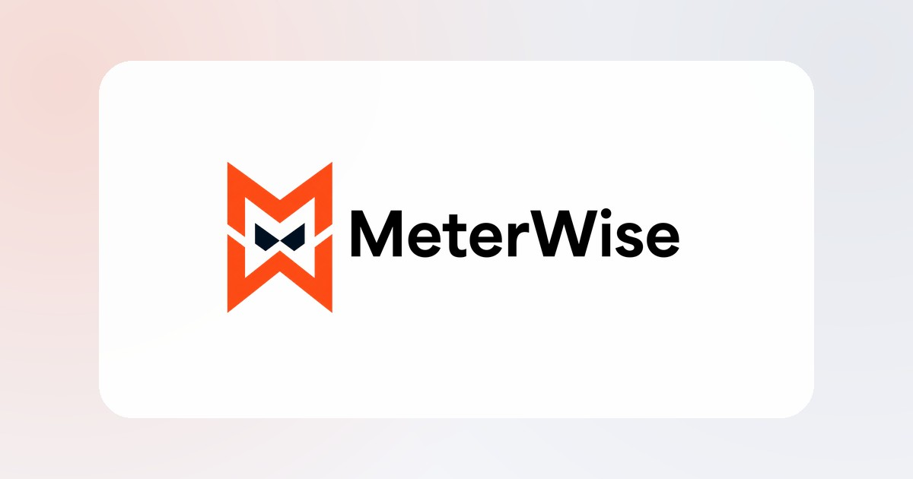

# MeterWise

Professionele, statische bedrijfswebsite voor **MeterWise** — gericht op AI-strategie, governance, compliance en verantwoord gebruik van kunstmatige intelligentie.

De website combineert een moderne 3D-intro met een toegankelijke informatiestructuur, responsieve interacties en een aparte kennismakingspagina. Het project draait volledig als statische website en is geschikt voor publicatie via GitHub Pages.



## Inhoud

- [Functionaliteit](#functionaliteit)
- [Techniek](#techniek)
- [Projectstructuur](#projectstructuur)
- [Lokaal starten](#lokaal-starten)
- [Kennismakingsformulier](#kennismakingsformulier)
- [Publiceren met GitHub Pages](#publiceren-met-github-pages)
- [Werken met branches](#werken-met-branches)
- [Toegankelijkheid](#toegankelijkheid)
- [Performance en SEO](#performance-en-seo)
- [Aanpassen](#aanpassen)
- [Bekende beperkingen](#bekende-beperkingen)
- [Contact](#contact)

## Functionaliteit

### Hoofdpagina

- Schermvullende zwarte 3D-intro vóór de bestaande website.
- Geanimeerde ringen, een driedimensionale merkkubus en cursorparallax.
- Scrollgestuurde overgang van de intro naar de reguliere website.
- Grote, responsieve hero met duidelijke primaire en secundaire acties.
- Secties voor diensten, aanpak, huisstijl, cases en contact.
- Actieve navigatiestatus tijdens het scrollen.
- Compactere sticky navigatie zodra de bezoeker naar beneden scrolt.
- Subtiele card-, knop-, tijdlijn- en cursorinteracties.
- Scroll-progressindicator en contextuele terug-naar-bovenknop.
- Contact-CTA die rechtstreeks naar de kennismakingspagina leidt.

### Kennismakingspagina

De route [`/kennismaking/`](kennismaking/) bevat een interactieve aanvraagflow in drie stappen:

1. Selectie van het gespreksonderwerp.
2. Organisatiegegevens, omvang en gewenst startmoment.
3. Contactgegevens, toestemming en verzending.

Aanvullende functies:

- Live voortgangsindicator.
- Validatie per stap.
- Live samenvatting van de aanvraag.
- Tijdelijk bewaren van ingevulde gegevens via `sessionStorage`.
- Honeypotveld tegen eenvoudige formulierbots.
- Formspree-ondersteuning met `mailto:` als fallback.
- Eigen responsive styling en reduced-motion-ondersteuning.

## Techniek

Het project gebruikt bewust geen framework of buildstap.

- Semantische HTML5.
- Moderne CSS met custom properties, Grid, Flexbox en 3D-transforms.
- Vanilla JavaScript.
- Progressive enhancement.
- GitHub Pages voor hosting.
- Een eigen domein: [`meterwise.nl`](https://meterwise.nl/).

Dit houdt de website snel, transparant en eenvoudig te onderhouden.

## Projectstructuur

```text
.
├── index.html                  # Hoofdpagina
├── styles.css                 # Algemene vormgeving en responsive gedrag
├── script.js                  # Interacties op de hoofdpagina
├── README.md                  # Projectdocumentatie
├── assets/
│   ├── favicon.svg            # Vectorlogo en favicon
│   ├── meterwise-banner.png   # Originele bannerfallback
│   ├── meterwise-banner.webp  # Geoptimaliseerde WebP-banner
│   ├── meterwise-banner.avif  # Geoptimaliseerde AVIF-banner
│   └── og-image.jpg           # Social-previewafbeelding
└── kennismaking/
    ├── index.html             # Kennismakingspagina
    ├── kennismaking.css       # Paginaspecifieke vormgeving
    └── kennismaking.js        # Meerstapsformulier en verzending
```

Andere bestaande merkbestanden in `assets/` kunnen naast deze kernbestanden blijven staan.

## Lokaal starten

Omdat de website statisch is, is een eenvoudige lokale webserver voldoende.

### Met Python

Voer vanuit de hoofdmap van het project uit:

```powershell
python -m http.server 8000
```

Open daarna:

- Hoofdpagina: [http://localhost:8000/](http://localhost:8000/)
- Kennismaking: [http://localhost:8000/kennismaking/](http://localhost:8000/kennismaking/)

### Met Node.js

Gebruik bijvoorbeeld `serve`:

```powershell
npx serve .
```

Open de URL die in de terminal wordt getoond.

> Open de HTML-bestanden bij voorkeur niet rechtstreeks via `file://`. Routes, modules en relatieve bestanden gedragen zich betrouwbaarder via een lokale webserver.

## Kennismakingsformulier

### Standaardgedrag

Zonder externe formulierdienst opent het formulier het standaard e-mailprogramma van de bezoeker. De ingevulde aanvraag wordt automatisch verwerkt in het onderwerp en de inhoud van een e-mail aan:

```text
meterwise@outlook.com
```

### Rechtstreeks verzenden met Formspree

Maak een formulier aan bij Formspree en vul het verkregen endpoint in bij `data-endpoint` in [`kennismaking/index.html`](kennismaking/index.html):

```html
<form
  id="kennismaking-form"
  class="meeting-form"
  novalidate
  data-meeting-form
  data-endpoint="https://formspree.io/f/JOUW-ID"
>
```

Wanneer een geldig endpoint is ingevuld:

- verstuurt JavaScript het formulier rechtstreeks naar Formspree;
- blijft de bezoeker op de website;
- verschijnt de ingebouwde succesmelding;
- wordt de tijdelijk opgeslagen formulierdata verwijderd.

Controleer na het configureren altijd:

- of de aanvraag aankomt;
- of het afzenderadres is geverifieerd;
- of spambeveiliging is geactiveerd;
- of de privacyverklaring past bij de gebruikte formulierdienst.

## Publiceren met GitHub Pages

1. Open de repository op GitHub.
2. Ga naar **Settings → Pages**.
3. Kies onder **Build and deployment** voor **Deploy from a branch**.
4. Selecteer de gewenste productiebranch, doorgaans `main`.
5. Selecteer de map `/ (root)`.
6. Sla de instellingen op.

Na een commit op de geselecteerde branch start GitHub automatisch een nieuwe deployment. De verwerking duurt meestal enkele minuten.

### Eigen domein

Het domein `meterwise.nl` wordt via DNS aan GitHub Pages gekoppeld. Let bij wijzigingen op het volgende:

- verwijder het eventuele `CNAME`-bestand niet;
- wijzig bestaande `A`, `AAAA` en `CNAME`-records alleen bewust;
- e-mailrecords zoals `MX`, `SPF`, `DKIM` en `DMARC` staan los van de websitehosting;
- activeer **Enforce HTTPS** zodra GitHub het certificaat heeft uitgegeven.

## Werken met branches

Gebruik `main` als stabiele productiebranch en voer nieuwe ontwikkelingen uit in een aparte branch.

Aanbevolen werkwijze:

```text
feature branch → pull request → controle → merge naar main
```

Voorbeeld met Git:

```powershell
git switch main
git pull origin main
git switch -c feature/naam-van-wijziging
```

Na het ontwikkelen:

```powershell
git add index.html styles.css script.js kennismaking assets
git commit -m "Beschrijf de wijziging kort"
git push -u origin feature/naam-van-wijziging
```

Open daarna een pull request naar `main`. Verwijder een featurebranch alleen wanneer je deze niet meer nodig hebt.

Als GitHub Pages tijdelijk vanaf een ontwikkelbranch publiceert, controleer dan vóór het mergen welke branch onder **Settings → Pages** als bron staat ingesteld.

## Toegankelijkheid

In het project zijn onder andere opgenomen:

- Semantische koppen, navigatie, formulieren en fieldsets.
- Skiplinks naar de hoofdinhoud en het formulier.
- Zichtbare toetsenbordfocus.
- Labels en toegankelijke namen voor interactieve elementen.
- `aria-live`-feedback bij validatie en verzending.
- Toetsenbordbediening voor navigatie en dialoogvensters.
- Ondersteuning voor `prefers-reduced-motion`.
- Progressive-enhancementfallbacks wanneer JavaScript niet beschikbaar is.

Blijf bij toekomstige wijzigingen controleren op kleurcontrast, logische tabvolgorde en begrijpelijke foutmeldingen.

## Performance en SEO

### Afbeeldingen

De hero-banner gebruikt een `<picture>`-element met deze volgorde:

1. AVIF.
2. WebP.
3. PNG-fallback.

De browser kiest automatisch het beste ondersteunde formaat. De vaste breedte en hoogte voorkomen onnodige layoutverschuivingen.

### Rendering

- Belangrijke afbeeldingen worden gericht geladen.
- Secties gebruiken waar mogelijk renderingoptimalisaties.
- Animaties gebruiken hoofdzakelijk `transform` en `opacity`.
- Zware externe JavaScriptbibliotheken zijn vermeden.

### Metadata

De pagina’s bevatten:

- Een unieke paginatitel en description.
- Open Graph-metadata.
- Twitter Card-metadata op de hoofdpagina.
- Een social-previewafbeelding van 1200 × 630 pixels.
- Een SVG-favicon en aanvullende iconmetadata.

Pas metadata aan wanneer de positionering, dienstverlening of pagina-inhoud verandert.

## Aanpassen

### Kleuren en globale instellingen

De belangrijkste kleuren en afmetingen staan bovenaan [`styles.css`](styles.css) als CSS-variabelen:

```css
:root {
  --orange: #ff4f18;
  --orange-2: #ff7a22;
  --black: #00101f;
  --blue: #001d3f;
  --container: 1180px;
}
```

De kennismakingspagina heeft eigen variabelen in [`kennismaking/kennismaking.css`](kennismaking/kennismaking.css).

### Navigatie naar de kennismakingspagina

De knop op de hoofdpagina hoort naar deze nette route te verwijzen:

```html
<a class="nav-cta" href="/kennismaking/">Plan kennismaking</a>
```

### Beweging

De 3D-intro en cursorinteracties staan in:

- de sectie `Cinematic 3D landing experience` in `styles.css`;
- het blok met `data-landing-intro` in `script.js`.

Houd nieuwe beweging subtiel en bied altijd een rustige fallback via `prefers-reduced-motion`.

## Bekende beperkingen

- GitHub Pages verwerkt geen formulieren op de server; daarvoor is een externe formulierdienst of eigen backend nodig.
- Het contactformulier gebruikt zonder endpoint het lokale e-mailprogramma van de bezoeker.
- De statische website bevat standaard geen CMS of beheerdersomgeving.
- Formulierdata in `sessionStorage` blijft alleen binnen de huidige browsertab beschikbaar.
- Wijzigingen op de productiebranch worden na een geslaagde Pages-deployment direct zichtbaar.

## Contact

Website: [meterwise.nl](https://meterwise.nl/)  
E-mail: [meterwise@outlook.com](mailto:meterwise@outlook.com)

---

© MeterWise. Alle rechten voorbehouden. Er is momenteel geen opensourcelicentie aan deze repository toegevoegd.
