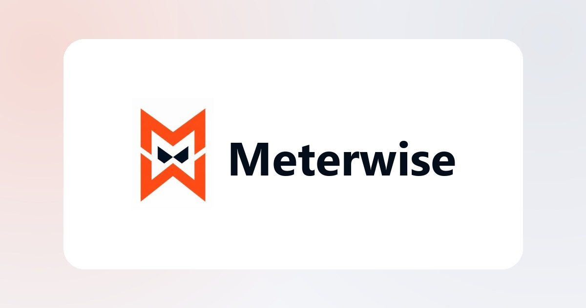

# MeterWise

Professionele, statische bedrijfswebsite voor **MeterWise** — gericht op AI-strategie, governance, compliance en verantwoord gebruik van kunstmatige intelligentie.

De website combineert een moderne, interactieve split-logo-intro met een toegankelijke informatiestructuur, responsieve interacties en een aparte kennismakingspagina. Het project draait volledig als statische website en is geschikt voor publicatie via GitHub Pages.



## Inhoud

- [Functionaliteit](#functionaliteit)
- [Techniek](#techniek)
- [Projectstructuur](#projectstructuur)
- [Lokaal starten](#lokaal-starten)
- [Kennismakingsformulier](#kennismakingsformulier)
- [Publiceren met GitHub Pages](#publiceren-met-github-pages)
- [Werken met branches](#werken-met-branches)
- [Toegankelijkheid](#toegankelijkheid)
- [Performance en SEO](#performance-en-seo)
- [Aanpassen](#aanpassen)
- [Bekende beperkingen](#bekende-beperkingen)
- [Contact](#contact)

## Functionaliteit

### Hoofdpagina

- Schermvullende zwarte 2.5D-intro vóór de bestaande website.
- De losse M en W kaderen in de beginsituatie het volledige introductietekstblok aan de boven- en onderkant in.
- Tijdens het scrollen bewegen beide helften naar rechts en sluiten ze daar tot het volledige MW-beeldmerk.
- De donkere oogvormen en een korte lichtnaad verschijnen precies op het sluitmoment.
- Geanimeerde ringen, subtiele diepte en cursorparallax.
- Scrollgestuurde overgang van de intro naar de reguliere website.
- Grote, responsieve hero met duidelijke primaire en secundaire acties.
- Secties voor diensten, aanpak, huisstijl, cases en contact.
- Actieve navigatiestatus tijdens het scrollen.
- Compactere sticky navigatie zodra de bezoeker naar beneden scrolt.
- Subtiele card-, knop-, tijdlijn- en cursorinteracties.
- Scroll-progressindicator en contextuele terug-naar-bovenknop.
- Contact-CTA die rechtstreeks naar de kennismakingspagina leidt.

### Kennismakingspagina

De route [`/kennismaking/`](kennismaking/) bevat een interactieve aanvraagflow in drie stappen:

1. Selectie van het gespreksonderwerp.
2. Organisatiegegevens, omvang en gewenst startmoment.
3. Contactgegevens, toestemming en verzending.

Aanvullende functies:

- Live voortgangsindicator.
- Validatie per stap.
- Live samenvatting van de aanvraag.
- Tijdelijk bewaren van ingevulde gegevens via `sessionStorage`.
- Honeypotveld tegen eenvoudige formulierbots.
- Formspree-ondersteuning met `mailto:` als fallback.
- Eigen responsive styling en reduced-motion-ondersteuning.

## Techniek

Het project gebruikt bewust geen framework of buildstap.

- Semantische HTML5.
- Moderne CSS met custom properties, Grid, Flexbox en 3D-transforms.
- Vanilla JavaScript.
- Progressive enhancement.
- GitHub Pages voor hosting.
- Een eigen domein: [`meterwise.nl`](https://meterwise.nl/).

Dit houdt de website snel, transparant en eenvoudig te onderhouden.

## Projectstructuur

```text
.
├── index.html                  # Hoofdpagina
├── styles.css                 # Algemene vormgeving en responsive gedrag
├── script.js                  # Interacties op de hoofdpagina
├── README.md                  # Projectdocumentatie
├── assets/
│   ├── favicon.svg            # Vectorlogo en favicon
│   ├── landing-mark-body.svg  # Oranje M/W-vorm voor de landingintro
│   ├── landing-mark-eyes.svg  # Donkere oogvormen voor het sluitmoment
│   ├── meterwise-banner.png   # Originele bannerfallback
│   ├── meterwise-banner.webp  # Geoptimaliseerde WebP-banner
│   ├── meterwise-banner.avif  # Geoptimaliseerde AVIF-banner
│   └── og-image.jpg           # Social-previewafbeelding
└── kennismaking/
    ├── index.html
    ├── kennismaking.css
    └── kennismaking.js
```

## Lokaal bekijken

Start vanuit de projectmap een lokale webserver:

```powershell
python -m http.server 8000
```

Open vervolgens:

- [http://localhost:8000/](http://localhost:8000/)
- [http://localhost:8000/diensten/](http://localhost:8000/diensten/)
- [http://localhost:8000/aanpak/](http://localhost:8000/aanpak/)
- [http://localhost:8000/voor-wie/](http://localhost:8000/voor-wie/)
- [http://localhost:8000/ai-act/](http://localhost:8000/ai-act/)
- [http://localhost:8000/contact/](http://localhost:8000/contact/)
- [http://localhost:8000/kennismaking/](http://localhost:8000/kennismaking/)

Gebruik bij voorkeur geen `file://`, omdat absolute routes dan niet hetzelfde werken als op GitHub Pages.

## Inhoud beheren

### Over Meterwise — `index.html`

| Onderdeel | HTML-locatie | Inhoud |
|---|---|---|
| Landingintro | `.landing-copy` | Merkregel, grote introductietekst en korte belofte |
| Hoofdpropositie | `section.hero` | Hoofdkop, uitleg, CTA’s en drie vertrouwenspunten |
| Governance Snapshot | `.governance-snapshot` | Statische uitleg van Ai-landschap, prioriteiten en 30/60/90-dagenactieroute |
| Herkenbare situaties | `#herkenbaar` | Zes signalen van Ai-gebruik zonder volledig overzicht of duidelijke afspraken |
| Waarom nu | `#waarom-nu` | Eenvoudige Ai Act-uitleg en drie redenen om tijdig te beginnen |
| Dienstenoverzicht | `#diensten` | Korte samenvatting van de drie belangrijkste routes |
| Aanpakoverzicht | `#aanpak` | Drie stappen: inzicht, beoordeling en inrichting |
| Risico en ISO | `.governance-context` | Zakelijke gevolgen van onbeheerst gebruik en de afbakening van ISO/IEC 42001 |
| Concrete output | `.scan-output` | Zes resultaten van de Governance Scan |
| Doelgroepenoverzicht | `#voor-wie` | Drie brede toepassingsomgevingen |
| Over Juan en Groningen | `#over-meterwise` | Oorsprong, werkwijze en vier kenmerken van de samenwerking |
| Veelgestelde vragen | `#veelgestelde-vragen` | Vier korte antwoorden over scan, Ai Act en ISO |
| Slot-CTA | `#contact` | Gescheiden knoppen naar direct contact en de kennismakingsintake |

De kaarten op de hoofdpagina zijn bewust compact. Verdiepende uitleg hoort op de subpagina’s.

### Diensten — `diensten/index.html`

| Anker | Inhoud |
|---|---|
| `#dienstenoverzicht` | Productlijn van oriënteren naar verankeren |
| `#quickscan` | Doel en opbrengst van de Ai QuickScan |
| `#governance-scan` | Kernproduct, belofte en concrete deliverables |
| `#implementatie` | Inrichting van rollen, beleid, processen en bewijs |
| ISO/IEC 42001-blok | Readinesspositie en afbakening ten opzichte van certificering |
| `#continuiteit` | Periodieke herbeoordeling en onderhoud |

### Ai Act — `ai-act/index.html`

| Anker | Inhoud |
|---|---|
| `#relevantie` | Rollen rond ontwikkelen, aanbieden en gebruiken van Ai |
| `#tijdlijn` | Hoofdmomenten vanaf augustus 2024 en genuanceerde verdere fasering |
| `#praktijk` | Zes maatregelen waarmee een organisatie direct kan beginnen |
| `#iso` | Verschil en samenhang tussen de Ai Act en ISO/IEC 42001 |
| `#bronnen` | Officiële, actuele bronnen en juridische afbakening |

### Aanpak — `aanpak/index.html`

| Anker | Inhoud |
|---|---|
| `#principes` | Context, proportionaliteit en aantoonbaarheid |
| `#werkwijze` | Intake, inventarisatie, beoordeling en activatie |
| `#domeinen` | Zeven vaste beoordelingsdomeinen |
| `#bewijs` | Bestaat, toegewezen, werkt en aantoonbaar |
| `#resultaat` | Acties voor de eerste 30, 60 en 90 dagen |

### Voor wie — `voor-wie/index.html`

| Anker | Inhoud |
|---|---|
| `#signalen` | Commerciële, bestuurlijke, operationele en risicosignalen |
| `#sectoren` | Zes relevante sectoromgevingen |
| `#fit` | Sterke fit en situaties waarin een andere eerste stap beter is |
| `#vragen` | Vijf diagnostische vragen voor bezoekers |

### Contact — `contact/index.html`

| Onderdeel | Locatie |
|---|---|
| Introductie en primaire mailknop | `.contact-copy` |
| Openbare contactgegevens | `.contact-card` |
| Verschil tussen contact en kennismaking | `.contact-route-grid` |
| Contact-e-mailadres | Alle links met `mailto:meterwise@outlook.com` |

### Kennismaking — `kennismaking/index.html`

| Onderdeel | Locatie |
|---|---|
| Introductie en verwachtingen | `.meeting-intro` |
| Gespreksonderwerpen | Eerste `.form-step` |
| Organisatievragen | Tweede `.form-step` |
| Contactgegevens | Derde `.form-step` |
| Formspree-endpoint | `data-endpoint` op het formulier |
| In-page verzending en statussen | `kennismaking/kennismaking.js` |

### Juridische pagina's

| Pagina | Inhoud en beheer |
|---|---|
| `algemene-voorwaarden/index.html` | De 22 artikelen met de zakelijke afspraken van Meterwise |
| `privacyverklaring/index.html` | De 18 onderdelen over gegevensverwerking, beveiliging, cookies en privacyrechten |
| `legal.css` | De gedeelde vormgeving van beide juridische pagina's |

De footer van iedere openbare pagina bevat afzonderlijke links naar **Algemene voorwaarden** en **Privacyverklaring**.

## Nog invullen en periodiek controleren

De juridische pagina's zijn gepubliceerd zonder zichtbare placeholders. Vul onderstaande gegevens aan zodra ze beschikbaar zijn en laat de teksten bij voorkeur juridisch controleren voordat Meterwise betaalde opdrachten aangaat.

- **KvK-nummer:** voeg dit in `algemene-voorwaarden/index.html` toe bij de definitie van Meterwise en in het contactblok onderaan. Voeg het ook toe onder **Wie is verantwoordelijk?** in `privacyverklaring/index.html`.
- **Btw-id:** voeg dit toe aan de contactblokken van beide juridische pagina's zodra het nummer bekend is.
- **Volledig vestigings- of postadres:** de pagina's vermelden nu alleen Appingedam, Nederland. Vervang of vul dit aan als een volledig zakelijk correspondentieadres gepubliceerd moet worden.
- **Leveranciers:** controleer de privacyverklaring wanneer hosting, e-mail, Formspree, cloudopslag, boekhouding, planning, analytics of andere verwerkers wijzigen. Benoem waar nodig de concrete leverancier en sluit een verwerkersovereenkomst.
- **Doorgifte buiten de EER:** controleer voor Formspree en toekomstige clouddiensten waar gegevens worden verwerkt en welke doorgiftewaarborgen gelden.
- **Cookies en analytics:** de huidige tekst gaat uit van functionele cookies en van toestemming wanneer later tracking wordt toegevoegd. Voeg een cookie-banner en apart cookiebeleid toe voordat niet-noodzakelijke tracking actief wordt.
- **Bewaartermijnen:** controleer of de genoemde termijnen van 2 en 5 jaar aansluiten op de uiteindelijke werkprocessen. Financiële administratie moet de toepasselijke fiscale bewaartermijn volgen.
- **Verzekering en aansprakelijkheid:** stem artikel 16 af op de daadwerkelijk afgesloten beroeps- en/of bedrijfsaansprakelijkheidsverzekering.
- **Versiedatum:** pas bij iedere inhoudelijke wijziging `Versie augustus 2026` op beide pagina's aan.
- **Periodieke controle:** beoordeel beide documenten minimaal jaarlijks en wanneer dienstverlening, leveranciers of wetgeving veranderen.

## Vormgeving en interactie aanpassen

- Globale kleuren, typografie, homepage en landingintro: `styles.css`.
- Gedeelde paginaonderdelen én de vier afzonderlijke visuele thema's van Diensten, Aanpak, Voor wie en Ai Act: `pages.css`.
- De bodyclasses `.page-diensten`, `.page-aanpak`, `.page-voor-wie` en `.page-ai-act` bepalen per pagina de kleurwereld, headerillustratie en thematische kaartaccenten.
- De codegebouwde illustraties staan onder `/* Distinct visual chapters */` in `pages.css`; ze gebruiken uitsluitend HTML en CSS en zijn dus vrij van stocklicenties.
- Scroll-, navigatie-, reveal- en landinglogica: `script.js`.
- Kennismakingspagina: `kennismaking/kennismaking.css` en `kennismaking/kennismaking.js`.

De belangrijkste globale variabelen staan bovenaan `styles.css`:

```css
:root {
  --orange: #FF4F18;
  --black: #00101F;
  --blue: #001D3F;
  --container: 1180px;
}
```

### Landinganimatie

De verticale startafstand van de twee logodelen staat in `.landing-stage`:

```css
--mark-top-offset: -96px;
--mark-bottom-offset: -28px;
```

Beide waarden zijn negatief, zodat beide delen uitsluitend recht omlaag bewegen. De mobiele afstanden staan in de mediaquery voor maximaal `640px`.

De cursorreactie staat alleen op `.landing-title`. JavaScript luistert uitsluitend naar pointerbeweging boven die titel en alleen bij een fijne muisaanwijzer.

## Formspree instellen voor verzenden vanaf GitHub Pages

GitHub Pages levert alleen statische bestanden en kan zelf geen e-mail versturen. Formspree ontvangt de formuliergegevens en stuurt de melding door naar het gekoppelde e-mailadres, terwijl de bezoeker op `meterwise.nl` blijft.

1. Maak op [formspree.io](https://formspree.io/) een account aan.
2. Maak een nieuw formulier voor **Kennismakingsaanvragen Meterwise**.
3. Koppel en bevestig `meterwise@outlook.com` als notificatieadres.
4. Kopieer het endpoint dat lijkt op `https://formspree.io/f/abcxyzde`.
5. Vul dit endpoint in bij `data-endpoint` in `kennismaking/index.html`. De huidige website is gekoppeld aan formulier `xqpzaaag`:

```html
<form
  id="kennismaking-form"
  data-meeting-form
  data-endpoint="https://formspree.io/f/xqpzaaag"
>
```

Wanneer een geldig endpoint is ingevuld:

- verstuurt JavaScript het formulier rechtstreeks naar Formspree;
- blijft de bezoeker op de website;
- verschijnt de ingebouwde succesmelding;
- wordt de tijdelijk opgeslagen formulierdata verwijderd.

Controleer na het configureren altijd:

- of de aanvraag aankomt;
- of het afzenderadres is geverifieerd;
- of spambeveiliging is geactiveerd;
- of de privacyverklaring past bij de gebruikte formulierdienst.

## Publiceren met GitHub Pages

1. Open de repository op GitHub.
2. Ga naar **Settings → Pages**.
3. Kies onder **Build and deployment** voor **Deploy from a branch**.
4. Selecteer de gewenste productiebranch, doorgaans `main`.
5. Selecteer de map `/ (root)`.
6. Sla de instellingen op.

Na een commit op de geselecteerde branch start GitHub automatisch een nieuwe deployment. De verwerking duurt meestal enkele minuten.

### Eigen domein

Het domein `meterwise.nl` wordt via DNS aan GitHub Pages gekoppeld. Let bij wijzigingen op het volgende:

- verwijder het eventuele `CNAME`-bestand niet;
- wijzig bestaande `A`, `AAAA` en `CNAME`-records alleen bewust;
- e-mailrecords zoals `MX`, `SPF`, `DKIM` en `DMARC` staan los van de websitehosting;
- activeer **Enforce HTTPS** zodra GitHub het certificaat heeft uitgegeven.

## Werken met branches

Gebruik `main` als stabiele productiebranch en voer nieuwe ontwikkelingen uit in een aparte branch.

Aanbevolen werkwijze:

```text
feature branch → pull request → controle → merge naar main
```

Voorbeeld met Git:

```powershell
git switch main
git pull origin main
git switch -c feature/naam-van-wijziging
```

Na het ontwikkelen:

```powershell
git add index.html styles.css script.js kennismaking assets
git commit -m "Beschrijf de wijziging kort"
git push -u origin feature/naam-van-wijziging
```

Open daarna een pull request naar `main`. Verwijder een featurebranch alleen wanneer je deze niet meer nodig hebt.

Als GitHub Pages tijdelijk vanaf een ontwikkelbranch publiceert, controleer dan vóór het mergen welke branch onder **Settings → Pages** als bron staat ingesteld.

## Toegankelijkheid

In het project zijn onder andere opgenomen:

- Semantische koppen, navigatie, formulieren en fieldsets.
- Skiplinks naar de hoofdinhoud en het formulier.
- Zichtbare toetsenbordfocus.
- Labels en toegankelijke namen voor interactieve elementen.
- `aria-live`-feedback bij validatie en verzending.
- Toetsenbordbediening voor navigatie en dialoogvensters.
- Ondersteuning voor `prefers-reduced-motion`.
- Progressive-enhancementfallbacks wanneer JavaScript niet beschikbaar is.

Blijf bij toekomstige wijzigingen controleren op kleurcontrast, logische tabvolgorde en begrijpelijke foutmeldingen.

## Performance en SEO

### Afbeeldingen

De hero-banner gebruikt een `<picture>`-element met deze volgorde:

1. AVIF.
2. WebP.
3. PNG-fallback.

De browser kiest automatisch het beste ondersteunde formaat. De vaste breedte en hoogte voorkomen onnodige layoutverschuivingen.

### Rendering

- Belangrijke afbeeldingen worden gericht geladen.
- Secties gebruiken waar mogelijk renderingoptimalisaties.
- Animaties gebruiken hoofdzakelijk `transform` en `opacity`.
- Zware externe JavaScriptbibliotheken zijn vermeden.

### Metadata

De pagina’s bevatten:

- Een unieke paginatitel en description.
- Open Graph-metadata.
- Twitter Card-metadata op de hoofdpagina.
- Een social-previewafbeelding van 1200 × 630 pixels.
- Een SVG-favicon en aanvullende iconmetadata.

Pas metadata aan wanneer de positionering, dienstverlening of pagina-inhoud verandert.

## Aanpassen

### Kleuren en globale instellingen

De belangrijkste kleuren en afmetingen staan bovenaan [`styles.css`](styles.css) als CSS-variabelen:

```css
:root {
  --orange: #ff4f18;
  --orange-2: #ff7a22;
  --black: #00101f;
  --blue: #001d3f;
  --container: 1180px;
}
```

De kennismakingspagina heeft eigen variabelen in [`kennismaking/kennismaking.css`](kennismaking/kennismaking.css).

### Navigatie naar de kennismakingspagina

De knop op de hoofdpagina hoort naar deze nette route te verwijzen:

```html
<a class="nav-cta" href="/kennismaking/">Plan kennismaking</a>
```

### Beweging

De split-logo-intro en cursorinteracties staan in:

- de sectie `Cinematic 3D landing experience` in `styles.css`;
- het blok met `data-landing-intro` in `script.js`.

Houd nieuwe beweging subtiel en bied altijd een rustige fallback via `prefers-reduced-motion`.

## Bekende beperkingen

- GitHub Pages verwerkt geen formulieren op de server; daarvoor is een externe formulierdienst of eigen backend nodig.
- Het contactformulier gebruikt zonder endpoint het lokale e-mailprogramma van de bezoeker.
- De statische website bevat standaard geen CMS of beheerdersomgeving.
- Formulierdata in `sessionStorage` blijft alleen binnen de huidige browsertab beschikbaar.
- Wijzigingen op de productiebranch worden na een geslaagde Pages-deployment direct zichtbaar.

## Contact

Website: [meterwise.nl](https://meterwise.nl/)  
E-mail: [meterwise@outlook.com](mailto:meterwise@outlook.com)

---

© MeterWise. Alle rechten voorbehouden. Er is momenteel geen opensourcelicentie aan deze repository toegevoegd.
